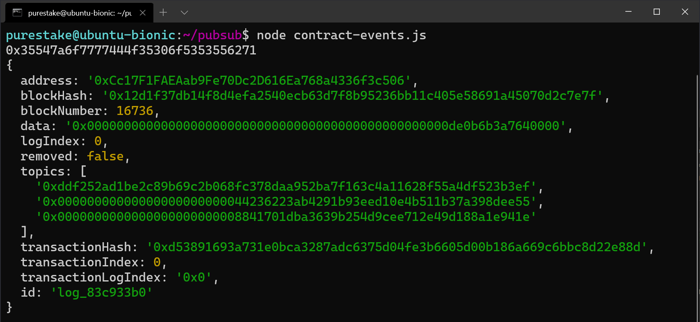

# Subscribe to Ethereum-style Events on Elysium

Elysium supports events subscription for Ethereum-style events. This allows you to wait for events and handle them
accordingly instead of polling for them.

It works by subscribing to particular events and for each subscription an id is returned. For each event that matches
the subscription a notification with relevant data is sent together with the subscription id.

In this guide, you will learn how to subscribe to event logs, incoming pending transactions, and incoming block headers
on Elysium Mainnet. This guide can also be adapted for Elysium Testnet

## Checking Prerequisites

The examples in this guide are based on an Ubuntu 18.04 environment. You will also need the following:

- Have MetaMask installed
- An account with funds. You can get LAVA for testing on once every 24 hours
  from [Elysium Faucet](https://faucet.atlantischain.network/ )
- Deploy your own ERC-20 token on Elysium. You can do
  following [our Remix tutorial](/docs/build/ethereum-api/dev_enviorments/remix), while first pointing MetaMask to
  Elysium

You need to install `Node.js` (for this example, you can use v16.x) and the npm package manager. You can download
directly
from Node.js or in your terminal:

### Ubuntu

```
curl -sL https://deb.nodesource.com/setup_16.x | sudo -E bash -

sudo apt install -y nodejs
```

### MacOs

```
# You can use homebrew (https://docs.brew.sh/Installation)
brew install node

# Or you can use nvm (https://github.com/nvm-sh/nvm)
nvm install node
```

You can verify that everything is installed correctly by querying the version for each package:

``` javascript
node -v
```

``` javascript
npm -v
```

As of writing this guide, the versions used were 14.6.0 and 6.14.6, respectively. You will also need to install the Web3
package by executing:

```
npm install --save web3
```

To verify the installed version of Web3, you can use the `ls` command:

```
npm ls web3
```

As of writing this guide, the version used was 1.3.0.

## Subscribe to Event Logs

Any contract that follows the ERC-20 token standard emits an event related to a transfer of tokens, that
is, `event Transfer(address indexed from, address indexed to, uint256 value)`. For this example, you will subscribe to
the logs of such events. Using the Web3.js library, you need the following piece of code:

```js
const Web3 = require('web3');
const web3 = new Web3('wss://ws.elysiumchain.tech');

web3.eth.subscribe('logs', {
    address: 'ContractAddress',
    topics: ['0xddf252ad1be2c89b69c2b068fc378daa952ba7f163c4a11628f55a4df523b3ef']
}, (error, result) => {
    if (error)
        console.error(error);
})
    .on("connected", function (subscriptionId) {
        console.log(subscriptionId);
    })
    .on("data", function (log) {
        console.log(log);
    });
```

Note that you are connecting to the WebSocket endpoint of Elysium. You're using
the `web3.eth.subscribe(‘logs’, options [, callback])` method to subscribe to the logs, filtered by the given options.
In this case, the options are the contract’s address where the events are emitted from and the topics used to describe
the event. More information about topics can be found in
the [Understanding event logs on the Ethereum blockchain](https://medium.com/mycrypto/understanding-event-logs-on-the-ethereum-blockchain-f4ae7ba50378)
Medium post. If no topics are included, you subscribe to all events emitted by the contract. In order to only filter
the `Transfer` event, you need to include the signature of the event, calculated as:

```js
EventSignature = keccak256(Transfer(address, address, uint256))
```

The result of the calculation is shown in the previous code snippet. You'll return to filtering by topics later on. The
rest of the code handles the callback function. Once you execute this code, you'll get a subscription ID, and the
terminal will wait for any event through that subscription:


Next, an ERC-20 token transfer will be sent with the following parameters:

- **From address** - `0x44236223aB4291b93EEd10E4B511B37a398DEE55`
- **To address** - `0x8841701Dba3639B254D9CEe712E49D188A1e941e`
- **Value (tokens)** - `1000000000000000000` - that is 1 with 18 zeros

Once you send the transaction, the log of the event emitted by the transaction will appear in the terminal:



The target event sends two pieces of indexed information: the `from` and `to` addresses (in that order), which are
treated like topics. The other piece of data shared by the event is the number of tokens, which is not indexed.
Therefore, there is a total of three topics (the maximum is four), which correspond to the opcode LOG3:


Consequently, you can see that the `from` and `to` addresses are contained inside the topics returned by the logs.
Ethereum addresses are 40 hex characters long (1 hex character is 4 bits, hence 160 bits or H160 format). Thus, the
extra 24 zeros are needed to fill the gap to H256, which is 64 hex characters long.

Unindexed data is returned in the `data` field of the logs, but this is encoded in bytes32/hex. To decode it you can
use, for example, this [Web3 Type Converter tool](https://web3-type-converter.onbrn.com/), and verify that the `data` is
in fact 1 (plus 18 zeros).

If the event returns multiple unindexed values, they will be appended one after the other in the same order the event
emits them. Therefore, each value is then obtained by deconstructing data into separate 32 bytes (or 64 hex character
long) pieces.


> **_NOTE:_**
> The pub/sub implementation in [Frontier](https://github.com/paritytech/frontier) is still in active development. This
> current version allows users to subscribe to specific event types, but there may still be some limitations.